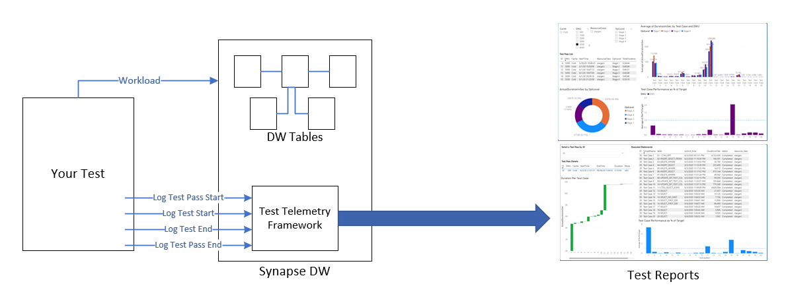

# Synapse-DW-Test-Telemetry
The Synapse Test Telemetry framework is a lightweight set of tables and stored procedures that make it easy to instrument Synapse performance tests or benchmarks.

You may be performing a competitive DW benchmark, a POC with/for a customer, or pre-deployment testing.  In all these cases, the importance of consistent measurement cannot be overstated.  And, the ability to easily visualize and analyze performance, perhaps through multiple changes in configuration or optimization, is extremely valuable.

This framework provides a pre-built and tested mechanism for capturing test execution times and reporting/analyzing them.  In particular, comparison over multiple iterations of optimization, configuration changes, or resizing is made very easy.  The framework also captures a detailed log of each statement run as part of your tests for later analysis (from sys.dm_pdw_exec_requests).

Finally, Power BI visuals, either pre-built or customized for your purpose, provide a powerful way to communicate your work to customers.

Conceptually, the Test Telemetry framework simply supports the logging of test durations, capturing start/end time for each step in a test, error information, and the content of sys.dm_pdw_exec_requests associated with each step in your tests.  It also captures descriptive attributes such as DW size, resource class, optimization level, and versions of your T-SQL so that you can slice-and-dice performance as these attributes change.

The picture below captures the intended use of the framework.  The way tests are driven is up to you, and can vary by scenario.  For any method of driving tests, simply wire in a few calls to the framework stored procedures, and the metrics needed for consistent measurement and analysis are captured.

Besides two scripts to create the framework in your target Synapse DW, this repository include two example test drivers. 

Example #1 is a SQL script which drives tests and is meant to be run in SSMS or Azure Data Studio in SQLCMD mode.

Example #2 is a very simple C# console application that drives series of test scripts.

To drive more full-featured testing, you can also use Adam Paternostro's Synapse Test Runner available in this repo.  The Synapse Test Runner supports both serial and multi-connection concurrent tests against Synapse, and it logs timings with the Test Telemetry Framework.

Finally, this repo include a starting Power BI report template that you can connect to your target DW and refresh to show your timings.  This report has some nice visualizations to examine the results of your tests.  But, it should be considered a tool more than a finished product.  Modify or add to the report to support your own understanding of your workload's performance, and to communicate results in the most effective way to your customer.

